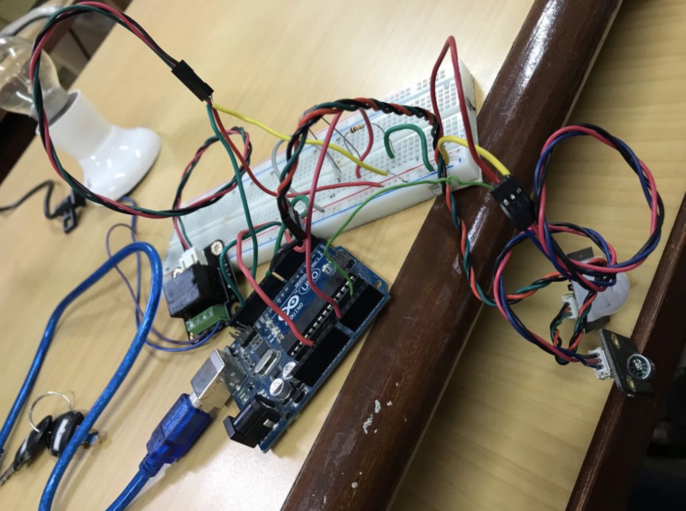

# Smart Lighting System

## Description

Electricity wastage is a major issue in public places such as hostels. Lack of accountability is one of the major reasons for it.
We have implemented a system which detects ambient light and presence( by motion and sound) to determine when to switch on and off the lights.
The Data is stored and visualised in cloud.

## Technologies Used

Cloud - Thingspeak
Device - Arduino Uno
Sensors - PIR, LDR, Sound